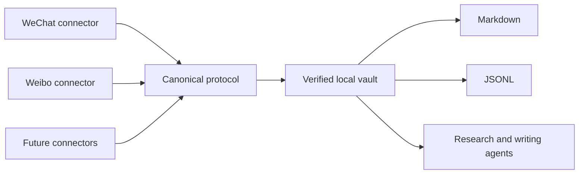

<div align="center">

# PersonaVault

### Turn a public voice into a living, verifiable knowledge asset.

Archive a person's public writing across platforms, keep it incrementally updated, and give humans and AI one trustworthy corpus to search, cite, and build on.

[⭐ Star the project](../../stargazers) · [💡 Request a connector](../../issues/new?template=connector_request.yml) · [🗣 Share your use case](../../discussions) · [🇨🇳 中文介绍](#中文)

</div>

---

Most export tools stop at “download complete.” PersonaVault asks harder questions:

- Did we capture every item the platform still exposes?
- Which records were deleted, restricted, pending, or failed?
- Can a stopped job resume without starting over?
- Will the next run fetch only what changed?
- Can an agent cite the original platform, account, item ID, and date?

PersonaVault turns platform archives into a durable, source-aware knowledge vault instead of a pile of files.

> If you want public knowledge to remain searchable, attributable, and useful to future agents, star the repo. Stars help us prioritize the next connector and show that trustworthy personal archives matter.

## What you get

```text
One person
├── WeChat public-account archive
├── Weibo archive
└── PersonaVault
    ├── vault.json              canonical source of truth
    ├── manifest.json           inventory and source counts
    ├── verification.json       machine-checkable evidence
    └── exports/
        ├── timeline.md         human-readable chronology
        └── content.jsonl       agent-ready records
```

The original platform archives remain intact. PersonaVault adds a shared identity model, idempotent merge, provenance, unified renderers, and independent verification.

## Why it is different

| Typical exporter | PersonaVault |
|---|---|
| Reports a successful command | Requires completion evidence |
| Treats a display name as identity | Locks stable platform account IDs |
| Restarts after interruption | Resumes from checkpoints |
| Downloads everything again | Runs full once, then incrementally |
| Hides inaccessible records | Preserves deleted/unavailable/failed states |
| Produces isolated files | Builds one cross-platform person corpus |
| Optimized for a single app | Installs as a skill for Codex, Claude, and WorkBuddy |

The core rule is simple: **never claim more completeness than the evidence supports.**

## Quick start

Requirements: Node.js 22+ and at least one supported platform connector.

```bash
git clone <repository-url> persona-vault
cd persona-vault
npm run validate
node scripts/install-skills.mjs
```

That links the same source skills into:

- `~/.codex/skills`
- `~/.claude/skills`
- `~/.workbuddy/skills`

Then ask your agent:

```text
Use $build-persona-vault to archive this person's public WeChat and Weibo history.
```

Or use the deterministic CLI directly:

```bash
node bin/personavault.mjs init \
  --name "Example Creator" \
  --output "./my-vault"

node bin/personavault.mjs import wechat \
  --vault "./my-vault" \
  --archive "./wechat-archive"

node bin/personavault.mjs import weibo \
  --vault "./my-vault" \
  --archive "./weibo-archive"

node bin/personavault.mjs verify --vault "./my-vault"
```

Re-run the platform connector later. Its existing state selects incremental mode; re-importing into PersonaVault adds new records, updates edited records under the same ID, and leaves unchanged records untouched.

## Supported today

| Source | First run | Later runs | Source-specific output | Unified import |
|---|---|---|---|---|
| WeChat public accounts via MPVault | Full, resumable | Resume/refresh | Article Markdown, local images, search index | ✅ |
| Weibo users | Full visible timeline | Known-boundary incremental | Markdown and Excel | ✅ |

Want YouTube, podcasts, blogs, newsletters, Zhihu, or another public source? [Open a connector request](../../issues/new?template=connector_request.yml) and react to the sources you want most. Community demand determines the roadmap.

## Built for trustworthy agents

Every canonical item keeps:

- platform and stable account ID;
- stable source item ID;
- publication timestamp and source URL;
- captured, deleted, unavailable, failed, or pending state;
- content checksum and capture provenance;
- import-run evidence.

This makes the vault useful for research, timelines, semantic search, quote cards, biographies, editorial workflows, and retrieval-augmented generation without losing the path back to the source.

## Architecture



The product is unified; collectors stay modular. A platform change should affect one connector, not every archive.

## Privacy by design

PersonaVault is local-first. Runtime archives, account sessions, target content, credentials, generated vaults, and machine-specific paths are ignored by Git. The repository includes a privacy scanner and only fictional fixtures.

Before publishing changes:

```bash
npm run privacy
```

Read [PRIVACY.md](PRIVACY.md) before sharing a vault or contributing a fixture. Archive only content you are authorized to access and use.

## Help shape the product

There are three high-leverage ways to help:

1. ⭐ **Star** if you want durable, agent-ready public knowledge archives.
2. 💡 **Request or vote for a connector** so the roadmap follows real demand.
3. 🧪 **Share a sanitized edge case** that improves recovery or verification without exposing private content.

Good first contributions include a new importer fixture, a renderer, a schema compatibility test, or a connector specification. See [CONTRIBUTING.md](CONTRIBUTING.md).

<a id="中文"></a>

## 中文：别让一个人的思想，困在随时会消失的平台里

一个真正值得研究的人，可能把十几年的人生、判断和思想，散落在几千条微博、几百篇公众号文章里。

今天还能搜到，不代表明天还在；你收藏过，也不代表以后找得到。

**PersonaVault 要做的，是把一个人散落在不同平台上的公开表达，变成一座属于你的、持续生长的人物知识库。**

### 你只需要告诉 Agent：我想保存谁

```text
使用 $build-persona-vault，把这个人当前可访问的公众号和微博历史完整归档，并在以后只做增量更新。
```

第一次运行，它尽可能保存平台当前仍可访问的全部历史内容；以后再运行，只寻找新增和修改。公众号长文、微博短帖、转发关系、发布日期、原始链接和不可访问状态，最终汇入同一个可搜索、可引用、可交给 AI 使用的人物语料库。

### 它保存的不只是网页，而是一条可被验证的思想时间线

- **不会假装“全部成功”**：删除、权限限制、抓取失败和平台数量差额都会单独说明。
- **不会每次从头再来**：中断可以续传，第二次开始自动增量，已有内容不会重复。
- **不会把出处弄丢**：每条内容都保留平台、账号、原始 ID、发布日期和来源链接。
- **不会把你锁进某个工具**：同时输出适合人阅读的 Markdown 和适合 Agent 使用的 JSONL。
- **不会上传你的私人档案**：本地优先，登录状态、目标内容和生成的知识库默认不进入 GitHub。

你可以用它研究一位思想家、整理一位创作者、保存一个品牌的长期表达、建立人物年表、寻找某个观点的原始出处，或者为研究、写作和传记准备一份真正可追溯的语料。

> 下载器解决“把文件拿回来”；PersonaVault 想解决的是：**多年以后，我们还能不能完整地理解一个人。**

### 如果这也是你想做的事

- [⭐ 给 PersonaVault 一个 Star](../../stargazers)：让更多人看到“可信人物档案”这个方向。
- [💡 告诉我们下一个要接入的平台](../../issues/1)：你的真实需求会直接影响连接器优先级。
- [🗣 分享你想保存的人或使用场景](../../discussions/2)：研究、写作、传记、教育和数字遗产都欢迎。

**你保存的不是一堆 Markdown，而是一个人跨越时间留下的公开思想。**

## License

MIT
