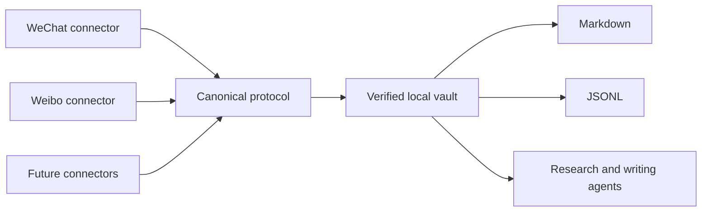

<div align="center">

# PersonaVault

### Turn a public voice into a living, verifiable knowledge asset.

Archive a person's public writing across platforms, keep it incrementally updated, and give humans and AI one trustworthy corpus to search, cite, and build on.

[⭐ Star the project](../../stargazers) · [💡 Request a connector](../../issues/new?template=connector_request.yml) · [🗣 Share your use case](../../discussions)

</div>

---

Most export tools stop at “download complete.” PersonaVault asks harder questions:

- Did we capture every item the platform still exposes?
- Which records were deleted, restricted, pending, or failed?
- Can a stopped job resume without starting over?
- Will the next run fetch only what changed?
- Can an agent cite the original platform, account, item ID, and date?

PersonaVault turns platform archives into a durable, source-aware knowledge vault instead of a pile of files.

> If you want public knowledge to remain searchable, attributable, and useful to future agents, star the repo. Stars help us prioritize the next connector and show that trustworthy personal archives matter.

## What you get

```text
One person
├── WeChat public-account archive
├── Weibo archive
└── PersonaVault
    ├── vault.json              canonical source of truth
    ├── manifest.json           inventory and source counts
    ├── verification.json       machine-checkable evidence
    └── exports/
        ├── timeline.md         human-readable chronology
        └── content.jsonl       agent-ready records
```

The original platform archives remain intact. PersonaVault adds a shared identity model, idempotent merge, provenance, unified renderers, and independent verification.

## Why it is different

| Typical exporter | PersonaVault |
|---|---|
| Reports a successful command | Requires completion evidence |
| Treats a display name as identity | Locks stable platform account IDs |
| Restarts after interruption | Resumes from checkpoints |
| Downloads everything again | Runs full once, then incrementally |
| Hides inaccessible records | Preserves deleted/unavailable/failed states |
| Produces isolated files | Builds one cross-platform person corpus |
| Optimized for a single app | Installs as a skill for Codex, Claude, and WorkBuddy |

The core rule is simple: **never claim more completeness than the evidence supports.**

## Quick start

Requirements: Node.js 22+ and at least one supported platform connector.

```bash
git clone <repository-url> persona-vault
cd persona-vault
npm run validate
node scripts/install-skills.mjs
```

That links the same source skills into:

- `~/.codex/skills`
- `~/.claude/skills`
- `~/.workbuddy/skills`

Then ask your agent:

```text
Use $build-persona-vault to archive this person's public WeChat and Weibo history.
```

Or use the deterministic CLI directly:

```bash
node bin/personavault.mjs init \
  --name "Example Creator" \
  --output "./my-vault"

node bin/personavault.mjs import wechat \
  --vault "./my-vault" \
  --archive "./wechat-archive"

node bin/personavault.mjs import weibo \
  --vault "./my-vault" \
  --archive "./weibo-archive"

node bin/personavault.mjs verify --vault "./my-vault"
```

Re-run the platform connector later. Its existing state selects incremental mode; re-importing into PersonaVault adds new records, updates edited records under the same ID, and leaves unchanged records untouched.

## Supported today

| Source | First run | Later runs | Source-specific output | Unified import |
|---|---|---|---|---|
| WeChat public accounts via MPVault | Full, resumable | Resume/refresh | Article Markdown, local images, search index | ✅ |
| Weibo users | Full visible timeline | Known-boundary incremental | Markdown and Excel | ✅ |

Want YouTube, podcasts, blogs, newsletters, Zhihu, or another public source? [Open a connector request](../../issues/new?template=connector_request.yml) and react to the sources you want most. Community demand determines the roadmap.

## Built for trustworthy agents

Every canonical item keeps:

- platform and stable account ID;
- stable source item ID;
- publication timestamp and source URL;
- captured, deleted, unavailable, failed, or pending state;
- content checksum and capture provenance;
- import-run evidence.

This makes the vault useful for research, timelines, semantic search, quote cards, biographies, editorial workflows, and retrieval-augmented generation without losing the path back to the source.

## Architecture



The product is unified; collectors stay modular. A platform change should affect one connector, not every archive.

## Privacy by design

PersonaVault is local-first. Runtime archives, account sessions, target content, credentials, generated vaults, and machine-specific paths are ignored by Git. The repository includes a privacy scanner and only fictional fixtures.

Before publishing changes:

```bash
npm run privacy
```

Read [PRIVACY.md](PRIVACY.md) before sharing a vault or contributing a fixture. Archive only content you are authorized to access and use.

## Help shape the product

There are three high-leverage ways to help:

1. ⭐ **Star** if you want durable, agent-ready public knowledge archives.
2. 💡 **Request or vote for a connector** so the roadmap follows real demand.
3. 🧪 **Share a sanitized edge case** that improves recovery or verification without exposing private content.

Good first contributions include a new importer fixture, a renderer, a schema compatibility test, or a connector specification. See [CONTRIBUTING.md](CONTRIBUTING.md).

## 中文简介

PersonaVault 把一个人散落在公众号、微博等平台上的公开表达，转化为可验证、可追溯、持续增量更新、可供 AI 使用的长期知识资产。

它不是简单的下载器：首次运行做当前可访问全量，后续只跑增量；删除、权限限制和失败都会诚实记录；公众号与微博保留各自采集器，通过统一协议汇总成一个人物库。

如果你也希望公共思想不因平台变化而消失，欢迎点 ⭐，并在 Issues 里告诉我们你最需要接入的平台和真实使用场景。

## License

MIT
